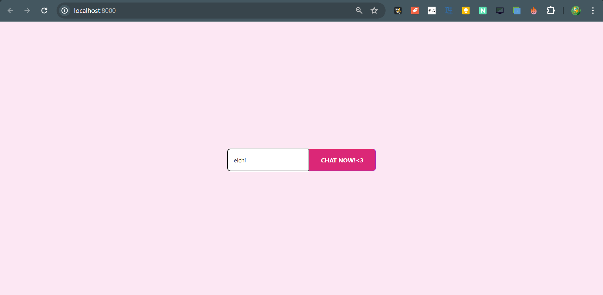
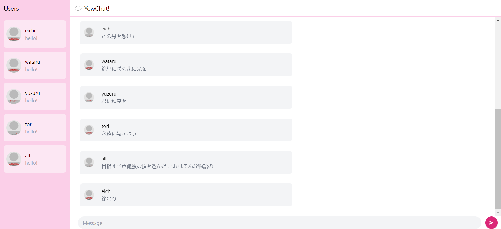

### Reika's YewChat 💬

#### 3.1 Original code

#### 3.2 Be Creative
I changed the theme to my favorite color, pink, in both <code>chat.rs</code> and <code>login.rs</code>. I also increased the font size in <code>chat.rs</code> to make it more readable, and edited some text (like the button in the login page, the username placeholder, the header in the chat page, and the message box placeholder) to customize it a bit more.

